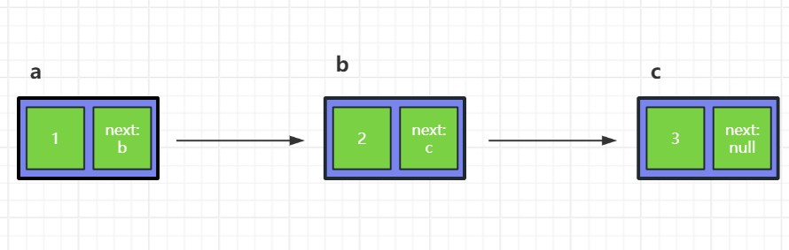

## 什么是链表

链表是一维数据结构

链表中的每个块是一个数据结构，数据结构中一个是存数据，一个是存引用

链表中的**每个节点，都认为自己是根节点**



链表的特点：

1. 空间上不是连续的
2. 每存放一个值，都要多开销一个引用空间

优点：

1. 只要内存足够大，就能存得下，不用担心空间碎片的问题
2. 链表的添加和删除非常容易

## 创建链表

```js
function Node(val){
  this.value = val
  this.next = null
}

const n1 = new Node(1)
const n2 = new Node(2)
const n3 = new Node(3)
const n4 = new Node(4)
const n5 = new Node(5)

n1.next = n2
n2.next = n3
n3.next = n4
n4.next = n5
```

## 遍历链表

```js
function ergodic(root){
    let tmp = root
    while(true){
        if(tmp!==null){
            console.log(tmp)
        }else{
            break
        }
        tmp = tmp.next
    }
}
```

## 递归遍历链表

```js
function recursion(root){
  if(root===null)return
  console.log(root.value)
  recursion(root.next)
}
```

