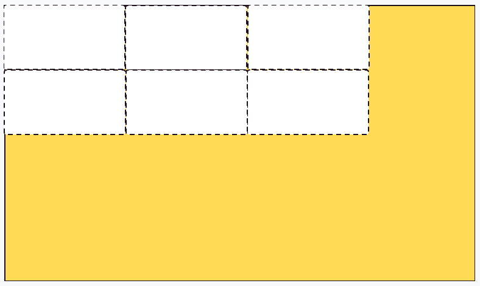
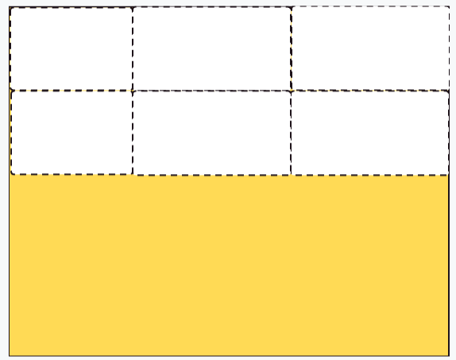
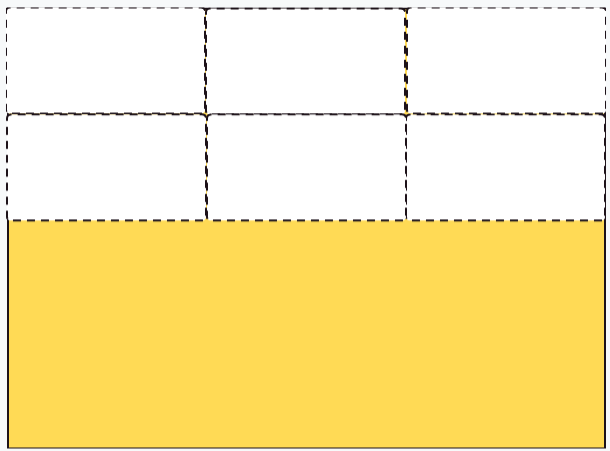
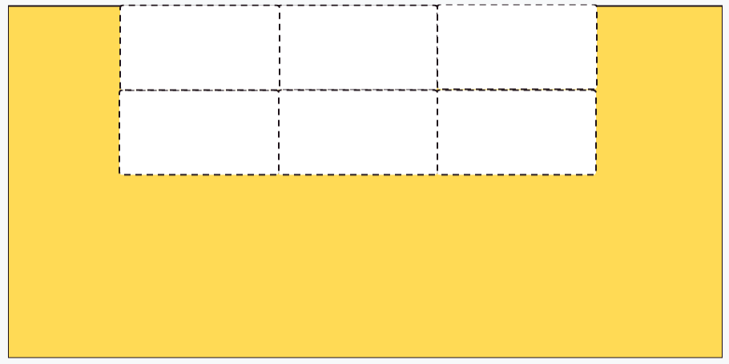
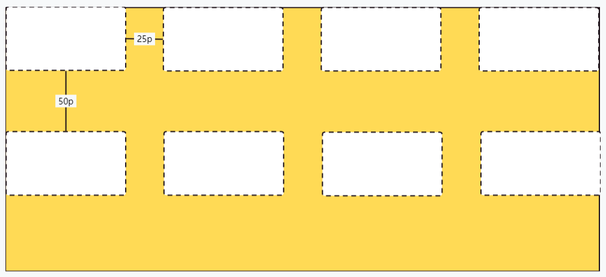
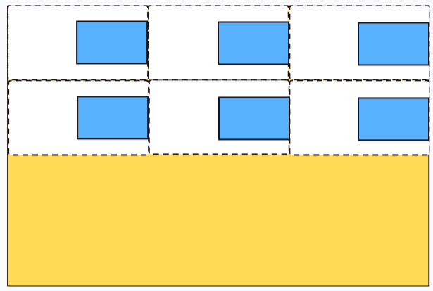
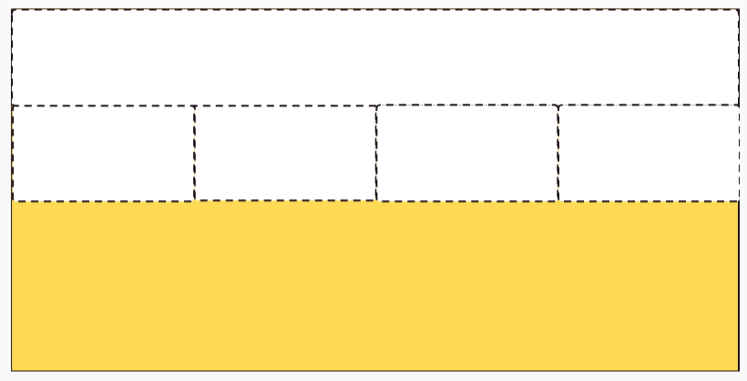

:::tip

grid网格布局是**多行多列**布局的终极解决方案

:::

## 生成网格布局

```css
.father{
  display: grid;
}
```

`display:grid`设置在容器后，容器内的所有子元素（不包括子项目内的元素）都为网格项目

## 定义行和列

网格有多少行多少列，也是在父元素容器中设置

```css
.father{
	display:grid;
	grid-template-columns: 100px 100px 100px;
	grid-template-rows: 80px 80px 80px 80px;
}
```

以上代码表示4行3列，每个网格宽100px高80px，因为固定了网格宽高，不会自动填满整个容器



有以下方式定义网格

### repeat()

3列，列宽为100px

```css
grid-template-columns: repeat(3,100px);
```


## fr

3列，第一列100px，剩余两列按照1:1比例占据剩余空间

```css
grid-template-columns: 100px 1fr 1fr;
//或者
grid-template-columns: 100px repeat(2,1fr);
```



3列，平分容器宽度

```css
grid-template-columns: repeat(3,1fr);
```



### auto-fill

每个网格以列宽100px尽量排满一行

```css
grid-template-columns: repeat(auto-fill,100px);
```


## 改变网格的分布

改变的不是网格内部的对齐方式，而是容器内部的子元素在容器中的分布，当网格占不满容器时有用

使用`justify-content`改变网格在水平方向的分布

使用`align-content`改变网格在垂直方向的分布

```css{5,6}
.father{
  display:grid;
  grid-template-columns: repeat(3,100px);
  grid-template-columns: repeat(6,60px);
  justify-content: center;
  align-content: start;
}
```



## 改变排列方向

使用`grid-auto-flow`可以设置子元素排列方向

设置子元素按列排放，即先从上向下排放，满3行，接着在第二列继续排下去

```css
.father{
  grid-template-rows: repeat(3,1fr);
	grid-auto-flow: column;
}
```


## 网格之间的间隙

使用`gap`可以设置每个子元素之间的间隔

`gap`是`grid-row`和`grid-column`的简写

```css
.father{
  gap: 25px 50px;
	//相当于
	gird-row: 25px;
	grid-column: 50px;


	//行和列都是一样的间隙
	gap: 10px;
}
```



## 网格内部的对齐

默认情况下，网格项目在单元格内部水平和垂直拉伸，以撑满单元格

这个属性在**父元素**设置，统一改变所有子元素的排列方式

使用属性`justify-items`设置水平方向的排列方式

使用属性`align-items`设置垂直方向的排列方式

```css
.father{
  display:grid;
  grid-template-columns: repeat(3,1fr);
  grid-template-columns: repeat(5,1fr);
  justify-items: end;
  align-items:center;
}
//所有item子元素将会水平靠右，垂直方向居中
.item{
  //如果不设置宽高，将会占满整个item网格
  width: 100px;
  height: 100px;
}
```



place-items是垂直对齐和水平对齐的简写

`place-items: start center; //垂直靠上，水平居中`

## 网格项目定位

使用`grid-area`可以根据网格线将网格定位到指定位置

`grid-area: row-start/column-start/row-end/column-end`设置左上角坐标和右下角坐标就能确认网格位置

```css
.father{
  display:grid;
  grid-template-columns: repeat(4,1fr);
  grid-template-rows: repeat(3,1fr);
}
.item.full-row{
  //占满第一行
  grid-area: 1/1/2/5;
}
```

