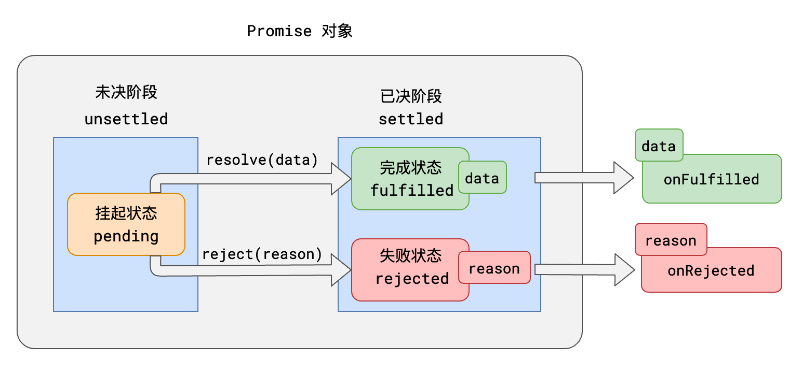
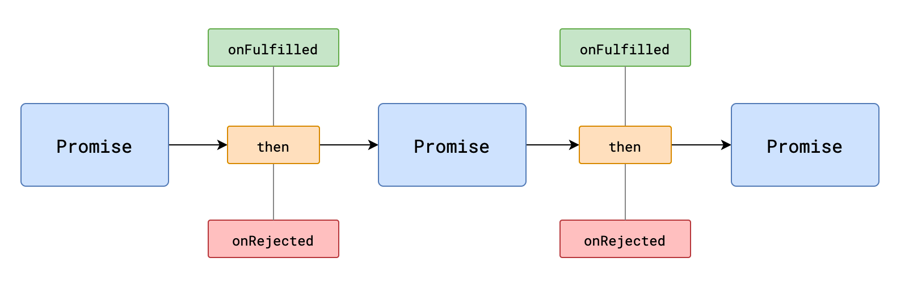

## Promise规范

Promise A+ 规定：

1. 所有的异步场景，都可以看作是一个异步任务，每个异步任务，在JS中应该表现为一个**对象**，该对象称之为**Promise对象**，也叫做任务对象

   

   根据常理，它们之间存在以下逻辑：

   - 任务总是从未决阶段变到已决阶段，无法逆行
   - 任务总是从挂起状态变到完成或失败状态，无法逆行
   - 时间不能倒流，历史不可改写，任务一旦完成或失败，状态就固定下来，永远无法改变

2. 每个任务对象，都应该有两个阶段、三个状态

   

3. `挂起->完成`，称之为`resolve`；`挂起->失败`称之为`reject`。任务完成时，可能有一个相关数据；任务失败时，可能有一个失败原因。

   

4. 可以针对任务进行后续处理，针对完成状态的后续处理称之为onFulfilled，针对失败的后续处理称之为onRejected

   

## 链式调用



1. then方法必定会返回一个新的Promise

   可理解为后续处理也是一个任务

2. 新任务的状态取决于后续处理：

   - 若没有相关的后续处理，新任务的状态和前任务一致，数据为前任务的数据

   - 若有后续处理但还未执行，新任务挂起。
   - 若后续处理执行了，则根据后续处理的情况确定新任务的状态
     - 后续处理执行无错，新任务的状态为完成，数据为后续处理的返回值
     - 后续处理执行有错，新任务的状态为失败，数据为异常对象
     - 后续执行后返回的是一个任务对象，新任务的状态和数据与该任务对象一致


## 实现Promise核心部分

```js
const PENDING = 'pending'
const FULLFILLED = 'fullfilled'
const REJECTED = 'rejected'
/**
 * 执行一个微任务
 * @description 兼容浏览器端和Node端
 * @param {Function} task 
 */
function runMicroTask(task){
  if(process && process.nextTick){
    process.nextTick(task)
  }else if(MutationObserver){
    const observer = new MutationObserver(()=>{
      task()
    })
    const div = document.createElement('div')
    observer.observe(div,{"childList":true})
    div.innerText = '1'
  }else{
    setTimeout(task, 0)
  }
}

function isPromise(obj){
  return !!(obj && typeof obj === 'object' && typeof obj.then === 'function')
}

class MyPromise{
  constructor(execute){
    this._value = undefined
    this._state = PENDING
    this._handlers = []
    try {
      execute(this._resolve.bind(this), this._reject.bind(this))
    } catch (error) {
      this._reject(error)
    }
  }
  /**
   * 修改状态并设置结果，一旦确定了状态不为pending，不能再改变
   * 修改状态后，执行任务队列
   * @param {*} data 
   * @param {PENDING | FULLFILLED | REJECTED} state 
   * @returns 
   */
  changeState(data,state){
    if(this._state !== PENDING){
      return
    }
    this._value = data
    this._state = state
    this._runHandlers()
  }
  /**
   * 当前任务完成
   * @param {*} data 
   */
  _resolve(data){
    this.changeState(data,FULLFILLED)
  }
  /**
   * 当前任务失败
   * @param {*} reason 
   */
  _reject(reason){
    this.changeState(reason,REJECTED)
  }
  /**
   * 
   * @param {Function} onFullfilled 任务成功后的回调
   * @param {Function} onRejected 任务失败后的回调
   * @returns {Promise} Promise 返回一个promise对象
   */
  then(onFullfilled,onRejected){
    return new MyPromise((resolve,reject) =>{
      this._pushToQueue(onFullfilled,FULLFILLED,resolve,reject)
      this._pushToQueue(onRejected,REJECTED,resolve,reject)
      this._runHandlers()
    })
  }
  /**
   * 将所有处理任务加入到任务队列等待resolve后执行
   * @param {*} executor then函数传递的参数，是一个函数，函数有一个参数
   * @param {*} state 成功或失败的状态
   * @param {*} resolve 成功状态返回任务结果，作为executor的参数传入
   * @param {*} reject 失败状态返回错误信息，作为executor的参数传入
   */
  _pushToQueue(executor,state,resolve,reject) {
    this._handlers.push({
      executor,
      state,
      resolve,
      reject
    })
  }
  /**
   * 执行任务队列，执行一个，从队列中删除一个，避免重复执行
   */
  _runHandlers(){
    if(this._state === PENDING) return
    while(this._handlers[0]){
      this._runOneHandler(this._handlers.shift())
    }
  }
  /**
   * 将任务加入到微任务中执行
   * 将handler展开，为了避免this的指向问题，展开后，this始终指向mypromise对象
   * @param {*} handler 
   */
  _runOneHandler({executor,state,resolve,reject}){
    runMicroTask(()=>{
      if(state!==this._state) return
      // 1.没有后续处理，新任务的状态和前任务一致
      if(typeof executor !== 'function'){
        this._state===FULLFILLED
        ?resolve(this._value)
        :reject(this._value)
        return
      }
      try {
        // 2.后续处理是无错的，可能是普通对象或者是一个promise对象
        const result = executor(this._value)
        if(isPromise(result)){
          // 2.1 是一个promise对象，新任务的状态和数据与该任务对象一致
          result.then(resolve,reject)
        }else{
          // 2.2 有普通对象，则新任务的状态为完成，数据和后续一致
          resolve(result)
        }
      } catch (error) {
        // 3.有后续处理，后续处理是有错的，则新任务的状态为失败，数据是异常
        reject(error)
      }
    })
  }
}

let p = new MyPromise((resolve,reject)=>{
  setTimeout(()=>{
    resolve('success')
  },1000)
})
const p2 = p.then(function A2(res){
  console.log('p成功',res)
  return Promise.reject('p2执行错误')
},function B2(err){
  console.log('p失败',err)
  throw 'p的错误'
})
const p3 = p2.then(function A3(res){
  console.log('p2成功',res)
},function B3(err){
  console.log('p2失败',err)
  throw 'error 3'
})
p3.then(()=>{
  console.log()
},()=>{})
setTimeout(()=>{
  console.log(p)
  console.log(p2)
  console.log(p3)
},1500)

```

