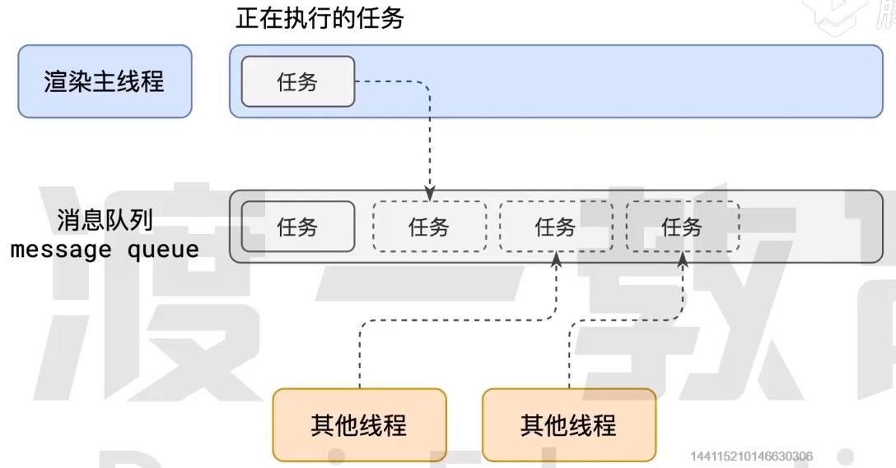
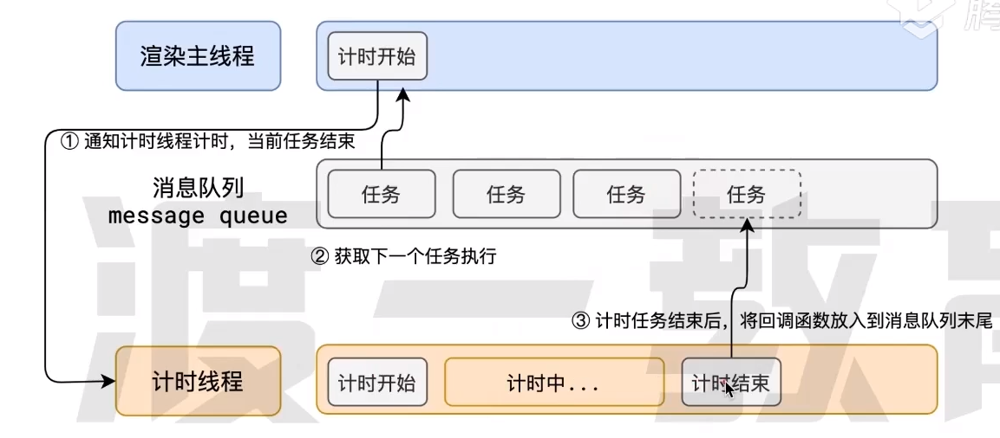

## 进程

程序运行需要有自己**专属的内存空间**，可理解为**一间房间**，这间房可以简单理解为进程

每个应用程序至少有一个进程，**进程之间相互独立**，即使要通信，也需要双方同意

## 线程

有了进程后，就可以运行程序的代码

运行代码的“人”称之为“线程”

一个进程至少有一个线程，所以在进程开启后会自动创建一个线程来执行代码，该线程称之为主线程

如果程序需要同时执行多块代码，主线程就会启动更多的线程来执行，所以一个进程可以包含多个线程

线程之间可以共享进程的内存空间

可以理解为**一间房（进程）至少有一个人（线程）在工作**

从效率上讲，创建进程需要分配内存等操作，所以创建线程的速度比进程快

进程结束时，线程也随之结束；最后一个线程结束后，进程才结束

## 浏览器有哪些进程和线程

浏览器是**多进程多线程**的应用

浏览器为了避免互相影响，渐少连环奔溃的几率，当启动浏览器后，会自动启动多个进程

主要进程：

1. 浏览器进程

   主要负责浏览器界面显示（不是网页内容），用户交互，子进程管理等。浏览器进程内部会启动多个线程处理不同任务

2. 网络进程

   负责加载网络资源，网络进程内部会启动多个线程处理不同的网络任务

3. 渲染进程

   渲染进程启动后，会启动一个渲染主线程，主线程主要负责执行HTML、CSS、JS代码

   默认情况下，浏览器会为每个标签页开启一个新的渲染进程，以保证不同的标签页之间互不影响

   将来可能会根据站点来开启进程

## 渲染主线程如何工作

1. 解析HTML
2. 解析CSS
3. 计算样式
4. 布局
5. 处理图层
6. 美妙刷新页面60次
7. 执行全局JS代码
8. 执行事件处理函数
9. 执行计算器的回调函数
10. ......

### 事件循环



1. 在最开始的时候，渲染主线程会进入一个**无限循环**
2. 每一个循环会检查消息队列（事件队列）中是否有任务存在，有，取出第一个任务执行，执行完一个后进入下一次循环；没有，则进入休眠状态
3. 其他所有线程（包括其他进程的线程）可以随时向消息队列添加任务。**新任务会从消息队列末尾加入**。在添加新任务时，如果主线程是休眠状态，则会将其唤醒以继续循环拿任务执行

整个过程就称之为事件循环（消息循环）

## 异步

代码执行的过程中，会遇到一些无法立即处理的任务，如

- 计时完成后需要执行的任务：`setTimeout`、`setInterval`

- 网络通信完成后需要执行的任务：`XHR`、`fetch`
- 用户操作后需要执行的任务：`addEventListener`

这些无法立即处理的任务，渲染主线程不会自己处理，而是交给特定的线程处理（计时线程，网络线程）

**渲染主线程承担这极其重要的工作，无论如何都不能阻塞**

因此浏览器选择异步来解决这个问题



主线程遇到计时事件，就会交给计时线程处理，期间主线程继续执行下一个任务不会等待计时线程处理完毕，计时线程到时间了就会将回调函数加入到事件队列等待主线程处理

:::tip

Q：如何理解JS的异步

A：

js是**单线程**语言，这是因为它运行在浏览器的渲染主线程中，而**渲染主线程只有一个**

渲染主线程承担诸多工作，**渲染页面、执行js**都在其中运行

如果使用同步的方式，就极有可能导致主线程产生阻塞，从而导致事件队列中的很多其他任务无法得到执行，导致繁忙的主线程白白消耗时间，另一方面导致页面无法及时更新，造成卡死现象

浏览器采用异步的方式来避免。具体做法是当某些任务发生时，比如计时器、网络、事件监听，主线程将任务交给其他线程去处理，自身立即结束任务的执行，转而执行后续的代码。当其他线程完成时，将事先传递的**回调函数包装成任务**，加入到事件队列的末尾排队，**等待主线程调度执行**

这种异步模式下，浏览器永不阻塞，从而最大限度保证单线程的流畅运行

:::

## JS会阻碍渲染

```html
<h1>hello</h1>
<button>change</button>
<script>
//这个会在duration时间内死循环，导致阻塞渲染
function delay(duration){
	var start - Date.now()
	while(Date.now() - start < duration){}
}
document.querySelector('button').click = function(){
  document.querySelector('h1').textContent = '我真帅'
  delay(3000)
}
</script>
```

执行过程：执行全局的同步js代码，遇到一个点击事件，则将这个任务交给交互线程，主线程这时已经执行完所有任务。当用户点击了按钮，修改了DOM（但并没有立即渲染到浏览器，需要加入到事件队列末尾排队），继续执行后面的代码，delay是一个需要执行3秒才能结束的函数，阻塞了DOM的渲染，等待3秒后执行完毕，主线程从事件队列中拿到渲染任务执行，最后才把“我真帅”渲染到浏览器

## 任务没有优先级

任务没有优先级，在事件队列中**先进先出**

但**事件队列有优先级**

以前将任务分为宏任务和微任务，但随着日益复杂的程序，只有这两个任务队列不够了

根据W3C最新解析

- 每个任务都有一个任务类型，同一个类型的任务必须在一个队列，不同类型的任务可以分属于不同的队列。在一次事件循环中，浏览器可以根据实际情况从不同的队列中取出任务执行
- 浏览器必须准备好一个微队列，微队列中的任务优先与其他任务执行

chrome至少包含下面的队列

- 微队列：优先级最高

  用于存放需要最快执行的任务

​		`Promise.resolve().then(cb)`：then里面回调函数会加入到微队列

​		`async/await`：await前的代码是同步执行的，await后的代码会加入到微队列

​		`MutationObserver`

- 交互队列：优先级高

  用于存放用户操作后产生的事件处理任务

- 延时队列：优先级中

  用于存放计时器到达后的回调任务

:::tip

Q：阐述一下JS事件循环

A：

事件循环又称消息循环，是浏览器渲染主线程的工作方式

在Chrome源码中，他开启一个不会结束的for循环，每次循环从事件队列中取出第一个任务执行，而其他线程只需要在合适的时候将任务加入到事件队列的末尾即可

过去把事件队列分为宏任务队列和微任务队列，这已经无法满足复杂的浏览器环境，取而代之的是一种更加灵活多变的处理方式

根据W3C官方解释，每个任务有不同的类型，同类型的任务必须在同一个队列，不同的任务可以属于不同的队列。

不同任务队列有不同的优先级，在一次事件循环中，由浏览器自行决定取哪一个队列的任务。但浏览器**必须**有一个微任务队列，微任务队列的任务具有最高优先级，必须优先调度执行

:::

:::tip

Q：JS中的计时器能做到精确计时吗？为什么

A：

不行

1. 计算机硬件没有原子钟，无法做到精确计时
2. 操作系统的计时函数本身就有少量偏差，由于JS的计时器最终调用的是操作系统的函数，也就携带了这些偏差
3. 按照W3C标准，浏览器实现计时器时，如果嵌套层级超过5层，则会带有4毫秒的最少时间，这样在计时时间少于4毫秒时又带来了偏差
4. 受事件循环的影响，计时器的回调函数只能在主线程空闲时运行，因此又带来了偏差

:::

## 参考链接

[原理-事件循环-HTML/CSS教程-腾讯课堂 (qq.com)](https://ke.qq.com/course/5892689/13883864042302033#term_id=106109971)