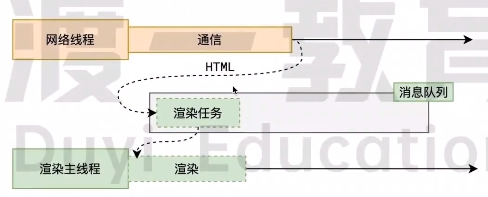
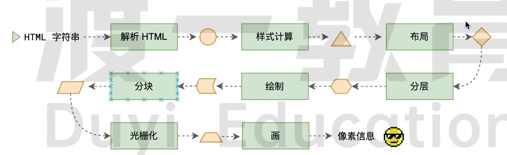
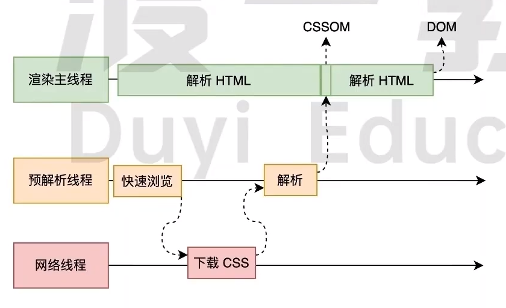
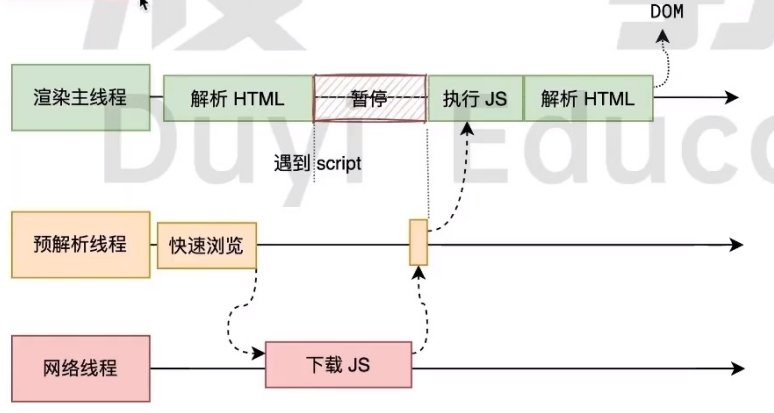
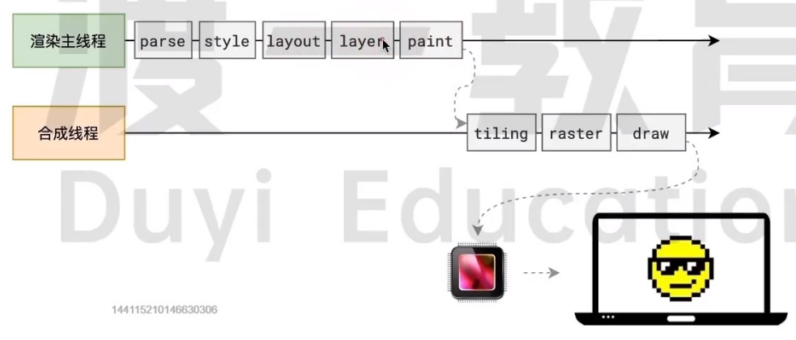
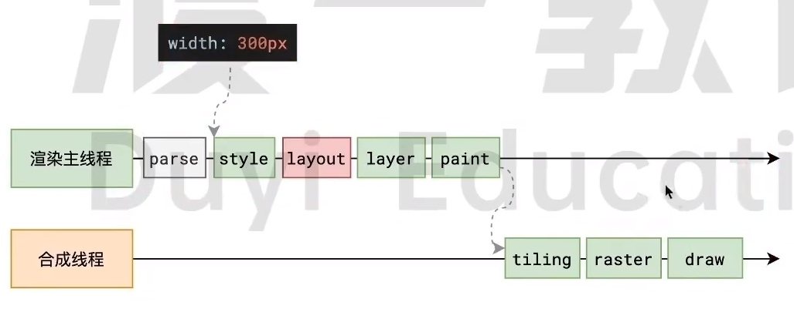

## 渲染时间点



当浏览器的**网络线程**收到HTML文档后，会产生一个**渲染任务**，并将其传递给**渲染主线程的消息队列**

在事件循环机制的作用下，渲染主线程取出消息队列中的渲染任务，**开启渲染流程**

## 渲染主线程



### 解析HTML

第一步是解析HTML

解析过程中遇到CSS解析CSS，遇到JS执行JS。**为了提高解析效率**，浏览器在开始解析前，会启动一个**预解析线程**，率先下载HTML中的外部CSS文件和外部JS文件



如果主线程解析到`link`位置，此时外部的CSS文件还没有下载解析好，主线程不会等待，继续解析后续的HTML。这是因为下载和解析CSS的工作是在预解析线程中进行的。**这就是CSS不会阻塞HTML解析的根本原因**



如果主线程解析到`script`位置，会**停止解析HTML**，转而等待JS文件下载好，并将全局代码解析执行完成后，才能继续接续HTML。这是因为JS代码的执行过程**可能会修改当前的DOM树**，所以DOM树的生成必须停止。这就是JS会阻塞HTML解析的根本原因

第一步完成后，会得到DOM树和CSSOM树，浏览器的默认样式、内部样式、外部样式、行内样式均会包含在CSSOM树中

:::tip 总结

CSS不会阻塞HTML解析：CSS是在预解析线程中进行

JS会阻塞HTML解析：JS可能会修改当前DOM树

:::

```js
//可以一行代码修改全局的div元素都加上红色边框
//随便找一个样式表styleSheets，给元素添加一个规则
document.styleSheets[0].addRule('div','border:1px solid red')
```


### 样式计算style

主线程会遍历得到DOM树，依次为树中的**每个节点计算出他最终的样式**

在这一过程中，很多预设值会变成绝对值，比如red会变成rgb(255,0,0)；相对单位会变成绝对单位，不如em变成px

这一步完成后，户得到一颗带有样式的DOM树

### 布局layout

布局阶段会依次遍历DOM树的每一个节点，**计算每个节点的几何信息**。例如节点的宽高、相对位置

大部分时候，DOM树和布局树并不一一对应。比如`display:none`的节点没有几何信息，因此不会生成到布局树；不过使用伪元素选择器，虽然DOM树中不存在这些伪元素，但它们拥有几何信息，所以会生成到布局树中。还有匿名行盒，匿名块盒等等都会导致DOM树和布局树无法一一对应

### 分层layer

主线程会使用一套复杂的策略对整个布局树中进行分层

分层的好处在于，将来某一个层改变后，**仅会对改层进行后续处理，从而提高效率**

滚动条、堆叠上下文、transform、opacity等样式会或多或少影响分层结果

为经常变动的节点设置will-change会单独设置一个分层，提高这个节点的响应效率

### 绘制paint

主线程会为每个层单独产生绘制指令集，用于描述这一层的内容改如何画出来（类似于canvas）

完成绘制后，主线程将每个图层的绘制信息提交给合成线程，剩余的工作将由合成线程完成

## 合成线程

### 分块tiling

合成线程首先对每个图层进行分块，将其划分为多个小区域

分块的工作会从线程池中拿出多个线程同时进行分块工作

### 光栅化raster

光栅化是将**每个块变成位图**

合成线程会将块信息交给GPU进程（这是浏览器的GPU进程），以极高的速度完成光栅化

GPU进程会启动多个线程来完成光栅化，并且优先处理靠近视口区域的快

此过程会用到GPU加速

### 画draw



合成线程计算出每个位图在屏幕上的位置，交给GPU（调用显卡）进行最终呈现

合成线程拿到每个层、每个块的位图后，生成一个个**指引quad**信息

指引会标识出每个位图应该画到屏幕的哪个位置，以及会考虑到旋转、缩放等变形

**变形发生在合成线程，与渲染主线程无关，这就是transform效率高的本质原因**

合成线程会把quad提交给GPU进程，由GPU进程产生系统调用，提交给GPU硬件，完成最终的屏幕成像

渲染进程是在沙盒中的，与操作系统的硬件是隔离的，保证了安全

## reflow



本质是重新计算layout树，过程很影响效率

当进行了会影响布局树的操作后，需要重新计算布局树，会引发layout

为了避免连续多次操作导致布局树反复计算，浏览器户合并这些操作，当JS代码全部完成后再进行统一计算。所以改动属性造成的reflow是异步完成的

也同样因为如此，**当JS获取布局属性时，就可能造成无法获取得到最新的布局信息**

浏览器在反复权衡下最终决定获取属性立即reflow

## repaint

本质是重新根据分层信息计算绘制指令

当改动了可见样式后，就需要重新计算，会引发repaint

由于元素的布局信息也属于可见样式，所以reflow一定会引起repaint

## 为什么transform效率高

因为transform既不影响布局也不会影响绘制指令，它影响的只是渲染流程的最后一个**draw**阶段

由于draw阶段在合成线程中，所以transform的变化几乎不会影响渲染主线程。所以渲染主线程无论多么忙碌，也不会影响transform的变化

## 参考链接

[原理-浏览器渲染原理-HTML/CSS教程-腾讯课堂 (qq.com)](https://ke.qq.com/course/5892689/13883868337269329#term_id=106109971)
