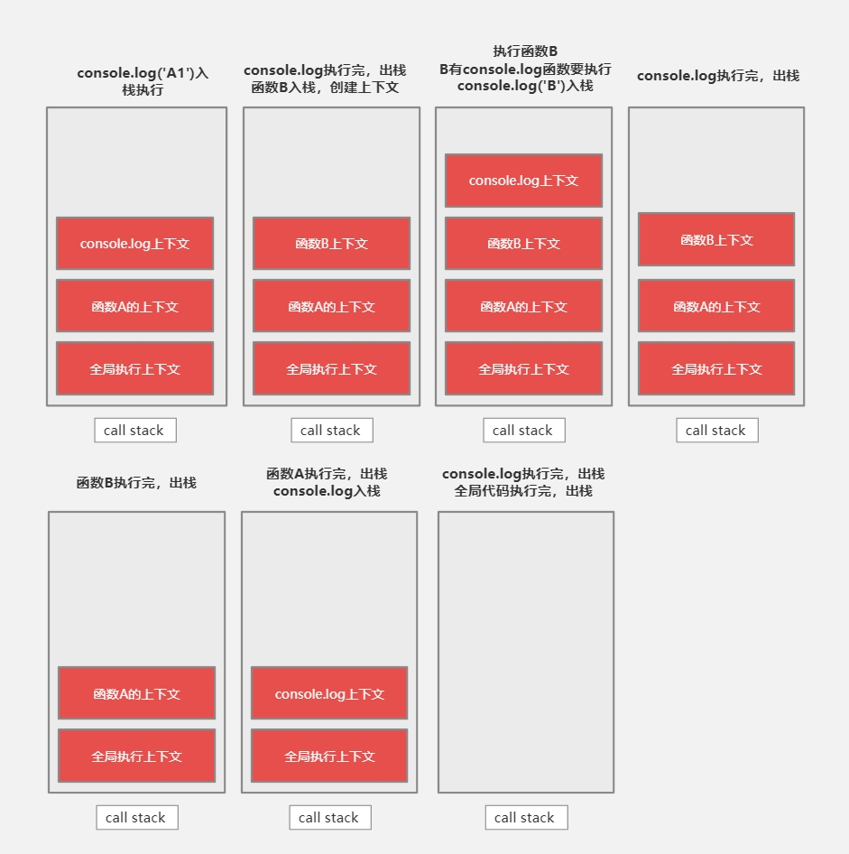

## 执行上下文

在一个函数运行之前，创建的一块内存空间，空间中包含有该函数执行所需要的的数据，为该函数执行提供支持。

执行上下文栈（call stack）：所有执行上下文组成的内存空间

:::tip

栈：一种数据结构，**先进后出，后进先出**

JS引擎始终执行的栈顶的上下文

:::

```js
console.log('global 1')
function A(){
	console.log("A1")
	function B(){
    console.log('B')
  }
  B()
  console.log("A2")
}
A()
console.log('global 2')
//输出：global 1-->A1-->B-->A2-->global 2
```

js代码执行必须要有环境，首先就是全局上下文



### 执行上下文中的内容

1. this指向

   - 直接调用函数，this指向全局对象
   - 函数外调用函数u，this指向全局对象
   - 通过对象调用或者new一个函数，this指向调用函数的对象或new出来的新对象

2. VO（Variable Object）变量对象

   VO中记录了该环境中所有声明的**参数、变量和函数**

   GO（Global Object）：全局执行上下文的VO

   AO（Active Object）：当前正在执行的上下文中的VO

   :::tip

   预编译阶段

   1. 确定所有形参值以及特殊变量arguments
   2. 确定函数中通过var声明的变量，将他们的值设置为undefined，提升到执行上下文的顶部；如果VO中已有改名称，则直接忽略（只有函数执行时遇到同名才会覆盖）
   3. 确定函数中通过字面量声明的函数（`function B(){}`函数声明），将他们的值设置为指向函数对象，如果VO中已存在改名称，则覆盖（函数是一等公民）

   :::

3. 函数执行过程中，遇到执行上下文中不存在的属性，则会从该函数之外的上下文中寻找（作用域链）

3. 作用域scope

预编译阶段，var声明的变量，会存在**提升**现象，将变量提升的函数执行上下文的顶部，并初始化未undefined

```js
function A(){
  console.log(b)
  var b = function(){}
}
//相当于
//function A(){
//	var b = undefined
//  console.log(b)
//	b = function(){}
//}
A() //undefined
```

预编译阶段，形参a，b设置为undefined，遇到同名变量，忽略

函数执行阶段，形参a设置为1，b设置为2，第二行代码输出1，2；然后变量a设置为123，b设置为999；最后打印出123，999

```js
function A(a,b){
  console.log(a,b)
  var a = 123
  b = 999
  console.log(a,b)
}
//
A(1,2)
// 1,2
//123,999
```

预编译阶段，函数声明，将他们的值设置为指向函数对象

执行阶段，函数b在预编译阶段已经被赋值了，可以正常执行

```js
function A(){
  console.log(b)
  b()
  function b(){}
}

//虽然函数b在console.log之后声明，但这已经将b只的指向了函数对象，所以这是b已经是有值的了
A()//打印函数b
```

预编译阶段，参数a，b设置为undefined，同名变量忽略；函数声明b指向函数对象，b已经被赋值

执行阶段，第二行输出1，function；b被赋值为123，function b(){}忽略（预编译阶端已经处理了），a被赋值为一个函数；执行console.log，输出function，123

```js
function A(a,b){
	console.log(a,b)
	var b = 123
	function b(){}
	var a = function(){}
	console.log(a,b)
}
A(1,2)
//首先输出1，function
//输出function，123
```

```js
var foo = 1
function A(){
  console.log(foo)
  if(!foo){
    var foo = 100
  }
  console.log(foo)
}
A()
//函数执行上下文中已经有变量foo
//输出undefined
//输出100
```

## 作用域链

1. VO中包含一个额外的属性，该属性指向创建该VO的函数本身

2. 每个函数在创建时，会有一个隐藏属性`[[scope]]`，**它指向创建该函数时的AO，函数在哪里定义（全局、函数中）AO就在哪**（如函数b是在函数a中创建的，那么函数b的[[scope]]指向函数a的执行上下文的VO）
3. 当访问一个变量时，会先查找自身VO中是否存在，如果不存在，则一次查找`[[scope]]`

```js
var a = 1
function A(){
  console.log(a)
}
function Special(){
  var a = 5
  var B = A
  B()
}
Special()
// 输出1
// 解析：A是在全局执行上下文创建的，A的[[scope]]指向的是全局AO，无论在哪里执行，都不会变
```


### 闭包

函数A中创建的函数B使用了函数A中的变量

如果函数A返回了函数B，函数B又使用了函数A中的变量，虽然函数A执行完毕已经消失，执行上下文应该也消失，但由于返回的函数B使用了函数A中的变量，那么函数B就保留了对函数A执行上下文的AO引用，函数B仍然可以使用函数A执行上下文的AO中的属性

```js
function A(){
  var count = 0
  function B(){
    count++
    console.log(count)
  }
  return B
}
var f = A() //执行函数A，返回函数B，函数B保留了函数A的执行上下文的引用，A执行完毕，但count不会被垃圾回收
f() //相当于执行函数B，函数B的AO中没有定义任何变量和函数，于是就巡着作用域链找，函数B的[[scope]]指向函数A的AO，在函数A的AO中找到了count，执行count++，打印出1
f() //同理，打印出2
```

## 总结

1. 执行上下文是基于对象的
2. 执行上下文是在**调用函数执行时**定义的，每次调用函数都会产生一个新的执行上下文环境
3. 执行上下文中值得关注**this值的指向**，由调用函数时决定this的指向，谁调用此函数，this就指向谁
4. 由上下文组成的内存空间称为上下文栈
5. 上下文栈（执行栈call stack）**先进后出，后进先出**，上下文从栈顶推入，
6. 作用域[[scope]]有全局作用域，函数作用域，块级作用域
7. 作用域在**函数定义时**就已经确定了，无论在哪里调用，不会改变作用域
8. 作用域只是一个地盘，其中没有变量，变量是通过作用域对应的执行上下文环境的变量对象（VO）实现的，但定义了变量如何访问的规则
9. 作用域是静态观念，执行上下文环境是动态的
10. 作用域只是用于划分在这个**作用域对应的执行上下文环境**里面定义的**变量的有效范围**，超出这个作用域则无效
11. 作用域链式一个指向函数定义时的变量对象（VO）的指针
12. 在一个作用域中查找一个变量，如果这个作用域中不存在，则会沿着作用域链向外面的作用域查找