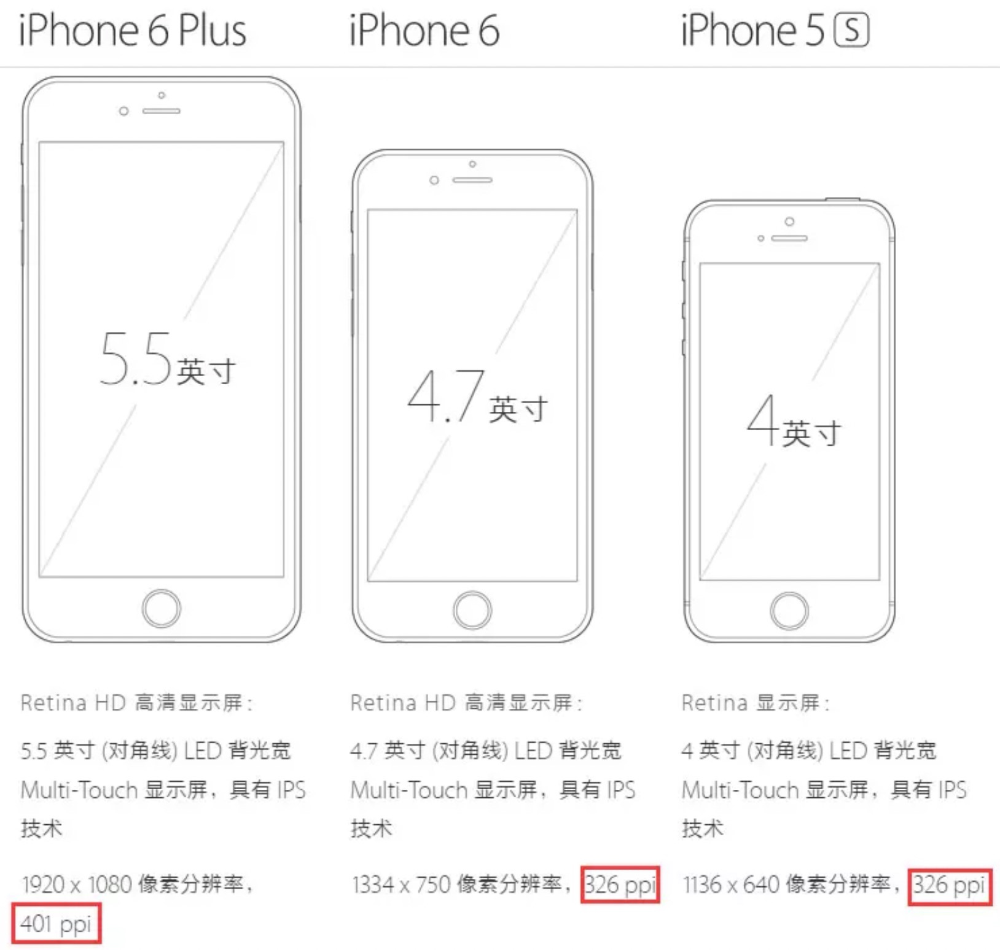
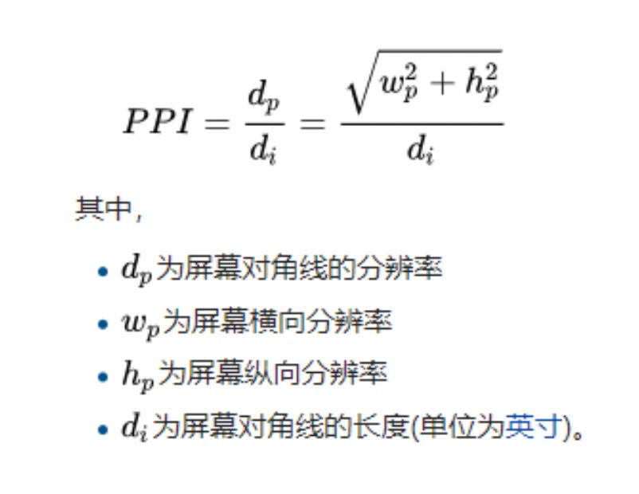
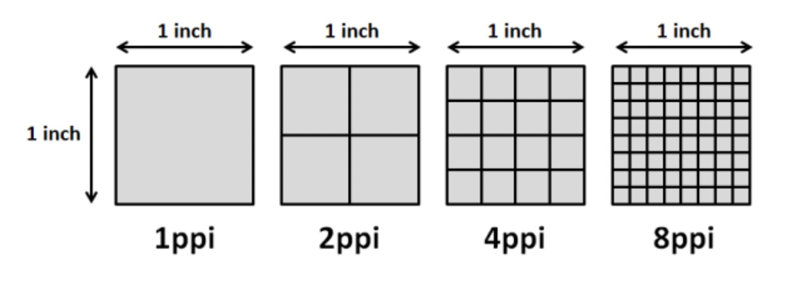
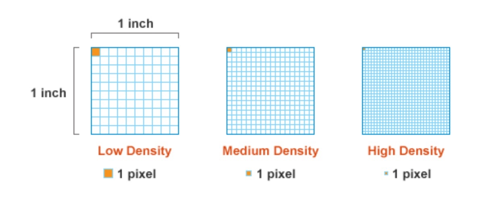
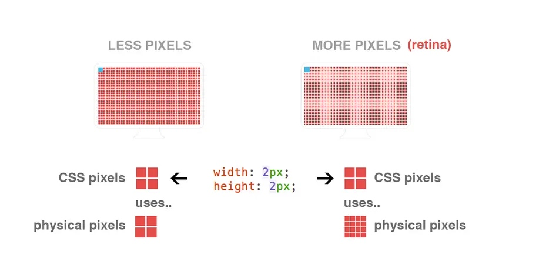
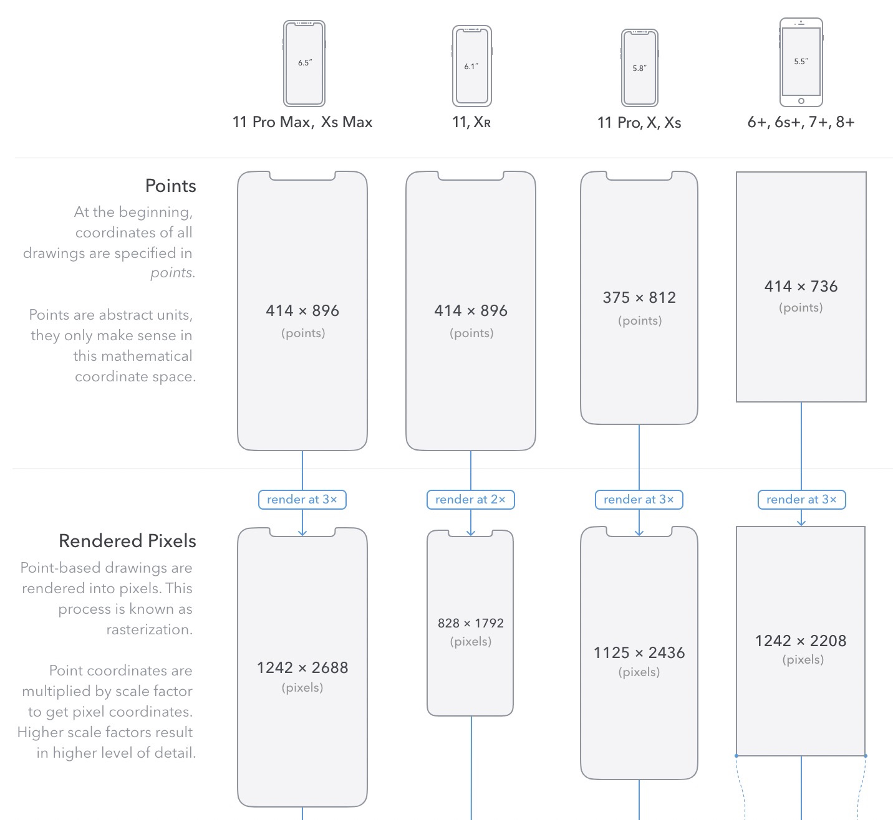

## 设备像素（物理像素）

首先要介绍的是“设备像素”，也被称之为“物理像素”。这是最好理解的一个名词，对于一般的显示设备来说，一个像素对应着屏幕上的一个发光点，这个点能够发出红、绿、蓝三种颜色的光，通过混合不同的 RGB 值，为我们创造了一个像素的颜色。

因此设备像素就是指实际存在的像素。

## 屏幕尺寸和像素密度（*PPI*）

明白了设备像素后，接下来我们再来普及 *2* 个概念，屏幕尺寸和像素密度（*PPI*）。

大家在买手机的时候，一般在手机配置信息里面还会有屏幕尺寸这个信息，一般以英寸为单位。

那么这个屏幕尺寸 *6.67* 英寸是指什么呢？难道是屏幕的面积么？

实际上并不是，首先英寸是一个长度单位，*1* 英寸（*inch*）等于 *2.54* 厘米（*cm*）。其次这里的 *6.67* 英寸指的是屏幕对角线的长度。

有了屏幕分辨率和屏幕尺寸的信息，我们就可以计算像素密度（*PPI*）。所谓像素密度，就是指 *1* 英寸下的设备像素数量，计算公式如下：

这里我们可以简单的计算一下 *iPhone6 Plus* 的 *ppi*：

## *CSS* 像素（设备独立像素、逻辑像素）

上面我们已经介绍了 *ppi* 的概念，那么 *ppi* 越高，所包含的设备像素也就越多。

但是这就会滋生出另外一个问题，如果我的 *CSS* 像素和设备像素是 *1:1* 的关系的话，随着设备像素的提升，图像就会越来越小。

那么怎么解决这个问题呢？

其实也非常好办，之前我们 *CSS* 像素和设备像素是 *1:1* 的关系，现在只需要将这个比例稍作修改即可。

正如上面的图片所示，以前 *CSS* 像素和设备像素 *1:1* 关系，*1* 个 *CSS* 像素对应 *1* 个设备像素，那么现在我修改这个比例，*1* 个 *CSS* 像素对应 *2* 个设备像素即可。

以前在做 *PC* 端网页开发的时候，由于 *CSS* 像素始终和设备像素是 *1:1* 的关系（不考虑缩放），所以给大家了一种错觉，以为 *CSS* 像素和设备像素就是 *1:1* 的对应关系，但是实际上 *CSS* 像素确是一个抽象的单位，具体含有多少个设备像素不是一定的。

## 像素比（*DPR*）

最后要介绍的概念就是像素比（*DPR*），英文全称为 *device pixel ratio*（设备像素比），计算公式为：*DPR* = 设备像素 / *CSS* 像素。

举个例子，如果 *CSS* 像素和设备像素 *1:1* 关系，那么 *DPR* 值就为 *1*。如果 *1* 个 *CSS* 像素对应 *2* 个设备像素，那么 *DPR* 值就为 *2*。

说简单点，就是一个 *CSS* 像素要用多少个设备像素来显示。如果 *DPR* 值为 *1*，表示用一个设备像素就够了，如果 *DPR* 值为 *2*，则表示一个 *CSS* 像素要用 *2* 个设备像素来表示。

可以通过 *window.devicePixelRatio* 获取一个设备的 *DPR*。

这里我们以 *iPhone6* 为例。

*iPhone6* 官方给出的分辨率为 *1334* x *750*，但是我们设置一个 *div*，宽度为 *375* 却能撑满整个手机。

