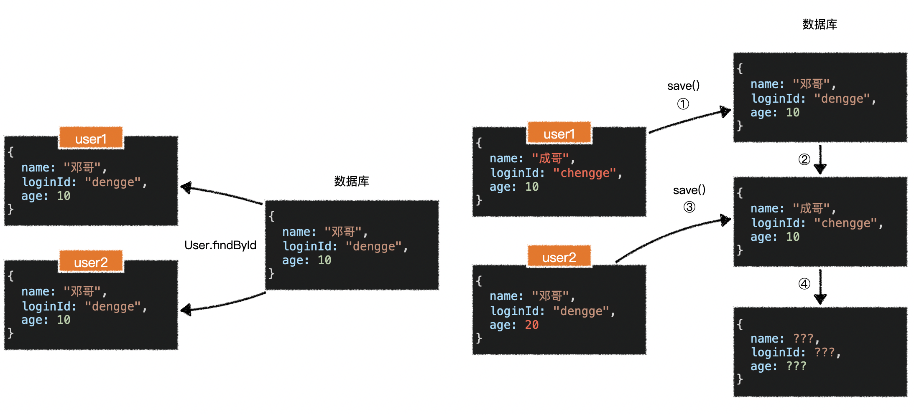
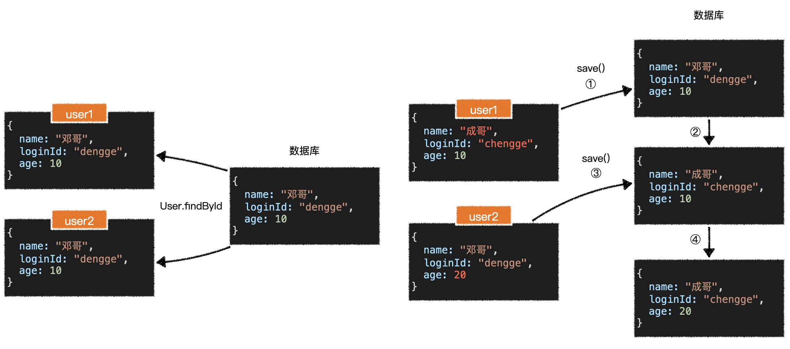
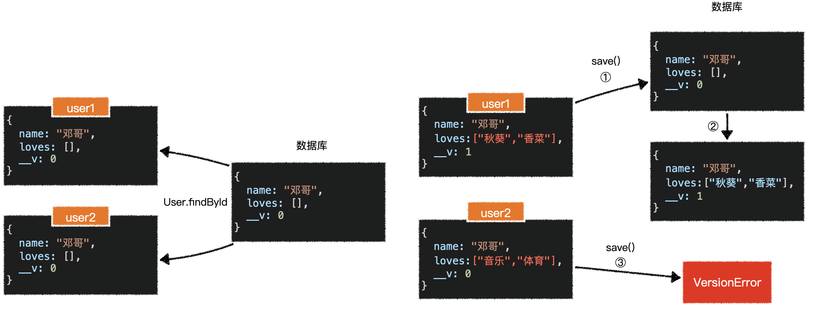

> 使用mongoose可以创建连接连接MongoDB数据库，定义模型，CRUD

## 创建连接

```js
//createConnection
const mongoose = require('mongoose')
mongoose.connect('mongodb://localhost/test',{
  //兼容性配置，兼容低版本
  useNewUrlParser: true
  useUnifiedTopology:true
})

mongoose.connection.on('open',()=>{
  console.log('连接已打开')
})
```

## schema定义结构

使用`schema`可以定义数据库中集合的文档的结构，由此产生模型

结构是描述某种数据中有哪些字段，字段的类型、字段的约束

在MongoDB中其实并不会像MySQL那样的强约束，MongoDB对集合没有任何限制，也不会对字段的类型有约束。而使用mongoose可以规范集合中文档的结构

###  定义结构

```js
const mongoose = require('mongoose')
const addressSchema = require('./addressSchema')
const userSchema = new mongoose.Schema({
  //简单配置
  loginId: String,
  //对loginId更多的配置
  loginId: {
  	type: String,
  	required: true,
  	//index: true, // 把该字段设置为索引，以后通过loginId查找时提高查询速度
  	unique: true // 特殊索引，唯一索引，并非验证
	},
  loginPwd:{
    type:String,
		required:true,
		trim:true,
    //密码不作为查询字段，即查询结果不会出现该字段
    select: false
  },
  name: {
  	type:String,
		required:true,
		trim:true,
		minlength:2,
		maxlength:10
	},
  loves:{
    type:[String],//数组是一个String类型
    required:true,
    default:[]
  },
  address:{
    //地址可能会在多个地方使用，可以提取出来成为一个schema
    type:addressSchema,
    required: true
  }
})

module.exports = mongoose.model('User',userSchema)
```

addressSchema

```js
const mongoose = require('mongoose')
module.exports = new mongoose.Schema({
	province:{
		type:string,
    required:true
	},
  city:{
     type:string,
     required:true
  }
})
```

Operation

```js
const mongoose = require('mongoose')
const addressSchema = require('./addressSchema')
const operationSchema = new mongoose.Schema({
  operation: {
    type: String,
    required: true,
    //约束可选择的范围，可以提取到一个模块
    enum: ['登录','注销','阅读文章']
  },
  address:{
    type: addressSchema,
    required: true
  },
  time:{
    type: Date,
    default: Date.now
  },
  //相当于外键
  userid:{
    //js没有的类型可以使用mongoose提供的类型
    type: mongoose.Types.ObjectId,
    required:true
  },
  extraInfo:{
    //任意类型
    type: mongoose.Schema.Types.Mixed,
  }
})
module.exports = mongoose.model('Operation',operationSchema)
```


### 根据结构创建模型

> 在定义好结构并根据结构创建模型后，就可以实行模型进行文档的增删改查操作

```js
module.exports = mongoose.model('User',userSchema)
```

### ensureIndex

在旧版本创建索引使用ensureIndex，为了兼容旧版本，需要配置

```js
mongoose.set("useCreateIndex",true)
```

## 备份与恢复

```bash
#备份
#将数据可备份到指定目录
mongodump -d <dbname> -o <backDir>

#恢复
#将指定目录的数据库恢复到指定的数据库
mongorestore -d <dbname> <backDir>
```


## 新增

### 方式1

创建模型对象，然后保存

```js
const obj = new <Model>(doc)
const resulr = obj.save()
```

### 方式2

直接使用函数创建对象

```js
async function addDoc(){
  const result = await <Model>.create(...obj)
}
```

### 创建操作细节

1. `mongoose`会为每个对象（包括子对象）添加唯一键`_id`，特别是在对象数组中，可以有效维护数据的唯一标识
   - 可以禁用自动为对象分配_id，在相应的schema中的对象位置配置`_id:false`
2. `mongoose`在创建文档是，会自动生成一个字段`__v`，该字段用于并发冲突
   - Schema的第二个参数中配置`versionKey:false`可以关闭
3. `mongoose`总是户在保存文档时触发验证，可以关闭这个行为
   - 在Schema的第二个参数中配置`validateBeforeSave: false`，这将导致使用该Schema的Model在保存时均不会触发验证
   - 在调用`save`方法或`create`方法时，传入一个配置对象，配置`validateBeforeSave:false`，这样就仅针对这次调用不进行验证。当给create方法传入配置时，为了避免歧义，需要将第一个参数设置为数组
4. `<Model>.create(doc,option)`相当于调用了`new <Model>(doc).save(option)`
   - 当给create传入多个文档，其内部会创建多个模型，然后循环调用它们的save方法
5. 无论哪种方式，都会得到`模型实例`，该实例户被`mongoose`持续跟踪，只要对模型实例的修改都会被记录，一旦重新调用模型实例的save方法，就会把之前对模型的所有更改持久化到数据库
6. 新增对象时，如果遇到Schema中**没有定义**的字段，则会**忽略**

## 原生查询

MongoDB原生查询

```js
//filter：查询条件
//projection：查询哪些字段
db.<collection>.find([filter],[projection])
db.getCollection(collection).find([filter],[projection])
```

### 游标

就是查询的返回结果，返回结果是一个对象，类似于迭代器，可在查询结果中进行迭代

```js
const cursor = db.<collection>.find([filter],[projection])
cursor.next() //得到第一个结果
```

cursor的成员：

- next()：游标向后移动，返回下一个结果，如果没有结果则报错
- hasNext()：判断游标是否还能向后移动
- skip()：跳过前面的n条数据，返回cursor
- limit(n)：取当前结果的n条数据，返回cursor
- sort(sortObj)：按照指定的条件排序，返回cursor，1：升序，-1：降序
- count()：得到符合filter的结果数量
- size()：得到最终结果的数量

由于某些函数会继续返回cursor，因此可以对其进行链式变成，返回cursor的函数称为了链中的一环，无论他们的调用顺序如何，始终按照下面的顺序执行

对结果先排序，然后从结果中去掉多少条，再取出多少条

```
sort -> skip -> limit
```

### 查询条件

`find`函数的第一个参数是查询条件`filter`

```js
db.<collection>.find(filter)

filter = {
  // 查找name等于ben的数据
  name: 'ben'
}

//使用正则查询
filter = {
  // 查找以7结尾，并且name包含‘敏’的数据
  loginId: /7$/,
  name:/敏/
}

//或者
filter = {
  $or:[
    {loginId: /7$/},
    {name:/敏/}
  ]
}

//匹配数组中有音乐的
filter = {
  loves:'音乐'
}

//并且
filter = {
  $and:[
    {loves:'音乐'},
    {loves:'体育'}
  ]
}

//年龄在(20~30]之间
filter = {
  age: {
    $gt: 20,
    $lte: 30
  }
}

//使用属性路径
filter = {
  "address.city": /重庆/
}
```

:::tip

如果根据_id查询要使用ObjectId来将字符串转换为ObjectId对象

```js
db.<collection>.find({
  _id: ObjectId('876asd7sd8777asd')
})
```

:::

#### 操作符

查询中出现的一些特殊的属性，它以`$`开头，表达了特殊的查询含义，这些属性称之为操作符operator

常用的操作符有

- $or：或者
- $and：并且
- $in：在...之中
- $nin：不在...之中
- $gt：大于
- $gte：大于等于
- $lt：小于
- $lte：小于等于
- $ne：不等于

### 投影

`find`函数的第二个参数`projection`，表示投影，类似于mysql的`select`

`projection`是一个对象，表示那些字段需要投影到查询结果中，哪些不需要

```js
//查询结果包含仅name和age，以及自动包含的_id
projection = {
  name:1, 
  age:1,
}
//查询结果除了name和age，其他都要包含
projection = {
  name:0, 
  age:0,
}
//查询结果仅包含name和age
projection = {
  name:1, 
  age:1,
  _id:0
}
```

:::tip

```js
//出错，包含name其他都不包含，不包含age其他都包含
// 除了_id外，其他的字段不能混写
projection = {
  name:1, 
  age:0,
}
```

:::

## mongoose查询

```js
<Model>.findById(id,projection) // 按照id查询单挑数据
<Model>.findOne(filter,projection) //根据条件和投影查询单条数据
<Model>.find(filter,projection) //根据条件和投影查询多条数据
```

`findOne`和`find`如果没有给与回调或等待，则不会真正进行查询，而是返沪i一个`DocumentQuery`对象，可以通过`DocumentQuery`对象进行链式调用进一步获取结果，知道传入了回调或等待或调用exec时，才真正执行

链式调用包括

- count
- limit
- skip
- sort

```js
let page = 1
const limit = 10
async function findUser(){
  await User.find({
    age: {
      $gt: 30
    }
  },{
    name:1,
    age:1
  })
  .skip((page - 1) * limit)
  .limit(limit)
  .sort({age:1})
}
```

### 关联

MongoDB是非关系型数据库，优势是存储和读取大量数据，不擅长集合与集合的关联数据

定义集合与集合的关系要在定义结构时使用`ref`定义，值是关联模型的名称

```js
const mongoose = require('mongoose')
//定义结构
const operationSchema = new mongoose.Schema({
  //相当于外键
  userid:{
    type: mongoose.Types.ObjectId,
    required:true,
    // 要关联的集合
    ref: "User"
  }
})

//创建模型
 mongoose.model('Operation',operationSchema)

//通过模型操作集合
//poplate('userid')就可以关联到User集合中对应id的用户
Operation.findOne({operation:'登录'}).populate('userid')
```

`populate(字段名,查询的字段字符串)`

```js
populate('userid','name age')
```


### 差异点 

1. `count`得到的时当前结果的数量

2. 查询`id`时，使用字符串就可以

3. `proecjtion`支持字符串写法

   ```js
   //查询结果不包含name和age字段
   User.find({
     age:{$gt:30}
   },"-name -age")
   ```

   

4. `sort`支持字符串写法

5. `populate`支持关联数据

## 原生更新

```js
db.<collection>.updateOne(filter,update,[options])

db.<collection>.updateMany(filter,update,[options])
```

### 过滤条件

同查询一致

### 更新内容

第二个参数决定了更新哪些字段

1. 字段操作

```js
//没有的字段就会新增字段
{
  $set:{name:'ken',"address.city":"广州市"}
}
//修改名字并且年龄【增加】2
{
  $set:{name:'ken'}
  $inc: {age: 2}
}
//年龄【乘以】2
{
  $mul:{age:2}
}

//修改字段名称
{
  $rename:{name:"fullname"}
}

//删除文档的字段
{
  $unset:{age:"","address.province":""}
}
```

2. 数组操作

```js
//向数组中增加一项
//没有的则增加，有的则不进行操作
{
  $addToSet: {
    loves: "秋葵"
  }
}
//向数组中增加一项
//无论数组中是否存在，都会添加
{
  $push:{
    loves:"秋葵"
  }
}

//增加【多项】
{
  $push:{
    loves: { $each:["豆角","番茄"] }
  }
}

//从数组中【删除】满足条件的值
{
  $pull:{
    loves:{$in: ["秋葵","番茄"]}
  }
}

//将数组中符合指定的字符【全部】修改
db.users.updateOne({
  loves:"其他"
},{
  $set:{
    "loves.$": "other"
  }
})
```

### 其他配置

第三个参数是其他配置

upsert：默认false，如果是true表示无法找到匹配项，则进行添加

## mongoose更新

### 方式1

在模型实例中进行更新，然后保存

```js
const user = await User.findById("7hdewe784y36d78as")
user.address.city = "广州市"
user.loves.push("秋葵","番茄")
await user.save()
```

### 方式2

```js
<Model>.updateOne(filter,doc,[options])
<Model>.updateMany(filter,doc,[options])
```

### 与原生的差别

1. `_id`可以直接使用字符串进行匹配
2. `doc`中可以省略`$set`，直接更改即可
3. 默认情况下，**更新**不会出发验证，需要在`options`设置`runValidators:true`开启验证

## 原生删除

```js
db.<collection>.deleteOne(filter)
db.<collection>.deleteMany(filter)
```

## mongoose删除

```js
<Model>.deleteOne(filter)
<Model>.deleteMany(filter)
```

## 索引

在数据库中，索引雷士与一个目录，用于快速定位到具体的内容

使用索引可以显著提高查询效率，但会增加额外的储存空间（非内存空间），因为索引需要开辟空间来储存索引

### mongdb中的索引操作

创建索引

```js
db.<collection>.createIndex(keys,[options])
```

- keys：指定索引中关联的字段，以及字段的排序方式
- options：索引的配置
  - background：默认false，建索引过程会阻塞其他数据库操作，是否以后台的形式创建索引
  - unique：默认false，是否是唯一索引
  - name：索引名称

```js
//以age为索引，升序排序
db.users.createIndex({age:1},{name:'user-age'})
```

```js
//查看所有索引
db.<collection>.getIndexes()
//查看集合索引占用空间
db.<collection>.totalIndexSize()
//删除所有索引
db.<collection>.dropIndexes()
//删除集合指定索引
db.<collection>.dropIndex("索引名称")
```

### 最佳实践

- 针对数据量大的集合使用索引
- 针对常用的查询或排序字段使用索引
- 尽量避免在程序运行过程中频繁创建和删除索引

# mongoose中的并发管理



当多个异步函数同时操作数据库时，就可能发生这样的情况，具体的场景往往发生在并发请求中

面对这种情况，`mongoose`作出以下假设：

- 当修改一个文档时，如果某些字段已经不再和数据库对应，说明这个字段的数据是脏数据（dirty data），对于脏数据，不应该对数据库产生影响
- 当修改一个文档时，如果字段和数据库是对应的，则是正常数据，正常数据可以正常的更改数据库


因此，`mongoose`对于上述场景的处理如下：



可以看出，对于`user2`的修改，`name`和`loginId`是脏数据，因此不会更新到数据库中，而`age`是正常数据，对它的更改会应用到数据库

然而，`mongoose`无法准确的判定对数组是否是脏数据，因此，如果遇到数组的修改，`mongoose`会做出如下处理：

- 当新增文档时，会自动添加字段`__v`，用于记录更新版本号，一开始为`0`
- 通过模型实例对数组进行修改后，保存时会在内部调用实例的`increment`函数，将版本号`+1`
- 当其他模型实例也更改了数组，保存时会对比版本号，如果不一致，则会引发`VersionError`

原理图如下：




出现错误是好事，可以提醒开发者：这一次保存的某些数据是脏数据，应该引起重视。开发者可以灵活的根据具体情况作出处理，比如提示用户保存失败，或者重新获取数据然后保存。

由于`mongoose`仅针对数组进行版本控制，如果要针对所有字段都进行版本控制，需要使用`mongoose`的插件：`mongoose-update-if-current`

> 插件地址：https://github.com/eoin-obrien/mongoose-update-if-current
>
> 该插件有一个`bug`，需要手动解决

使用插件后，所有的字段都将受到版本控制，一旦版本不一致，将引发`VersionError`

参考来源

渡一教育