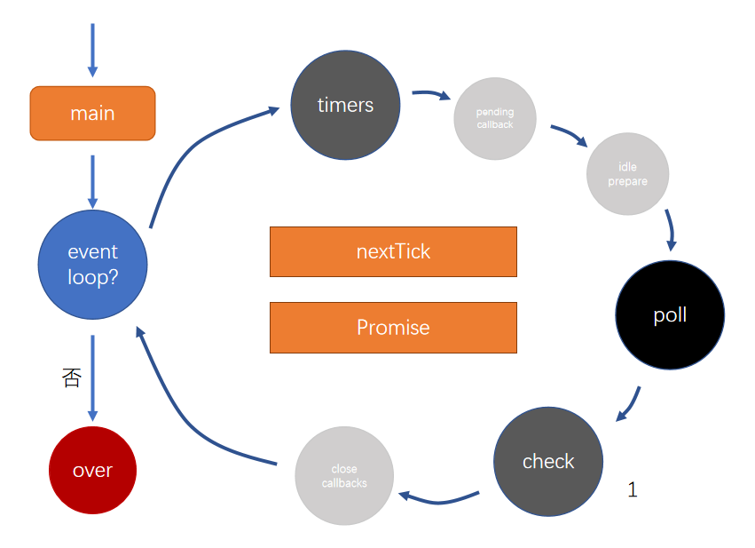

## timers

存放计时器的回调函数

计时结束才会把回调推入timers队列

每次事件循环到达timers队列时会检查计时器是否结束，结束了就把回调推入到timers队列

## poll（轮询队列）

轮询队列

除了timers、checks，绝大部分回调都会放入poll队列

比如文件的读取、监听用户请求createServer()的回调函数

:::tip

运作方式

如果poll中有回调，一次执行回调，直到清空队列

如果poll中没有回调

​	等待其他队列中出现回调，结束该阶段，进入下一阶段

​	如果其他队列也没有回调，持续等待出现回调为止

:::

```js
const fs = require('fs')
const start = Date.now()
setTimeout(function f1(){
  console.log('setTimeout',Date.now()-start)
},200)

fs.readFile('./index.js','utf-8',function f2(){
  console.log("readFile")
  const start = Date.now()
  while(Date.now() - start < 300){}
})

//先输出readFile
//后输出setTimeout，时间已经超过了设定的200ms
```

### 执行过程

执行开始，计时没有达到指定时间，timers队列没有回调；文件没有读取完成，poll队列没有回调；poll队列进入轮询，等待其他队列中的回调出现

文件读取完成，poll队列有回调了，执行回调f2，输出readFile，然后卡了300ms，这个过程中计时结束，把回调f1推入timers队列中，但f2还没执行完，等待执行完成，时间已经超过了计时的200ms

f2执行完成，poll队列已经清空，等待其他队列的回调；因为timers队列中有回调函数，所以poll队列这轮结束，开始下一个事件循环

下一个事件循环开始，timers队列有f1回调，执行f1，输出`setTimeout 500ms`，timers队列清空

进入poll队列，poll队列没有回调，等待其他队列中回调的出现

## checks（检查阶段）

`setImmediate(callback)`类似于`setTimeout(()=>{},0)`，不同在于`setImmediate()`会把回调直接放入到队列中，而`setTimeout(()=>{},0)`还需要检查一下是否计时结束，结束了把回调放入队列

`setImmediate()`的执行效率比`setTimeout(()=>{},0)`高很多，而且`setTimeout(()=>{},0)`并不会真的是0ms，最小执行时间是4ms


```js
setTimeout(()=>{
  console.log('setTimeout')
},0)

setImmediate(()=>{
  console.log('setImmediate')
})
//有可能先输出setImmediate后输出setTimeout
//也有可能先输出setTimeout后输出setImmediate
```

 

```js
const fs = require('fs')

fs.readFile('./index.js',()=>{
  setTimeout(()=>console.log(1))
  setImmediate(()=>console.log(2))
})

//先输出2，后输出1
```

执行过程：事件循环开始，timers队列空，poll队列空，在poll队列轮询等待回调，文件读取完成，poll队列有回调了，执行回调，将setTimeout的回调放入timers队列，setImmediate的回调放入checks队列。

poll发现其他队列有回调，结束poll，进入事件循环的checks阶段，checks队列有回调，执行输出2，checks队列清空，结束本轮事件循环

下一轮事件循环开始，timers队列有回调，执行回调，输出1，timer队列清空； 进入poll阶段，poll队列为空，开始poll轮询，等待队列出现回调

## 微任务队列

不属于事件循环中

:::tip

事件循环中，**执行一个回调前**，必须先清空微任务队列

:::

### nextTick（优先级最高）

### Promise 

```js
setImmediate(()=>{
  console.log(1)
})
process.nextTick(()=>{
  console.log(2)
  process.nextTick(()=>{
    console.log(6)
  })
})
console.log(3)
Promise.resolve().then(()=>{
  console.log(4)
  process.nextTick(()=>{
    console.log(5)
  })
})

//输出：326451
```

