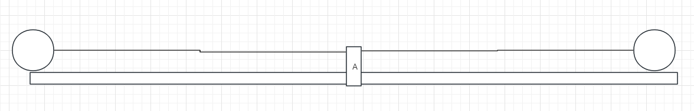

## 实现动画的基本要素

1. 起始点
2. 结束点（目标点）
3. 速度：每间隔一段时间（interval）变化的值

## 基础匀速动画

```js
function startMove(dom,target){
  if(dom.timer){
    clearInterval(dom.timer)
  }
  //速度为负数，向左运动
  //速度为正数，向右运动
  let speed = target - dom.offsetLeft > 0 ? 4 : -4
  dom.timer = setInterval(()=>{
    if(Math.abs(target - dom.offserLeft) < Math.abs(speed)){
      clearInterval(dom.timer)
      return
    }
    dom.style.left = dom.offsetLeft + speed + 'px'
  },30)
}
```

## 加速度动画

加速度不变，速度越来越快的运动

公式：
$$
v=v+at
$$


```js
function startMove(dom,target){
  if(dom.timer){
    clearInterval(dom.timer)
  }
  let speed = 4
  //加速度为正数，如果速度为正数，则向右做加速度运动
  //加速度为负数，如果速度为正数，则先向右做减速运动，后向左做加速运动
  let a = 2
  dom.timer = setInterval(()=>{
    speed+=a
    dom.style.left = dom.offsetLeft + speed + 'px'
  },30)
}
```

## 缓冲动画

随着距离减小，速度也跟着减小的运动

```js
function startMove(dom, target) {
  if (dom.timer) {
    clearInterval(dom.timer)
    dom.timer = null
  }
  let speed = null
  dom.timer = setInterval(() => {
    //越接近目标点，速度越小，除以7是避免速度值过大
    speed = (target - dom.offsetLeft) / 7
    // speed正数，向右运动，小数向上取整，使其最后达到目标点
    // speed负数，向左运动，小数向下取整，使其最后达到目标点,-1.1向下取整是-2
    speed = speed > 0 ? Math.ceil(speed) : Math.floor(speed)
    if (dom.offsetLeft === target) {
      clearInterval(dom.timer)
      return
    }
    dom.style.left = dom.offsetLeft + speed + 'px'
  }, 30)
}
```

### 支持不同属性的动画

```js
function startMove(dom, attr, target) {
  if (dom.timer) {
    clearInterval(dom.timer)
    dom.timer = null
  }
  let speed = null,
    curAttrVal = null
  dom.timer = setInterval(() => {
    if (attr === 'opacity') {
      curAttrVal = parseFloat(getStyle(dom, attr)) * 100
    } else {
      curAttrVal = parseFloat(getStyle(dom, attr))
    }
    speed = (target - curAttrVal) / 7
    // speed正数，向右运动，小数向上取整，使其最后达到目标点
    // speed负数，向左运动，小数向下取整，使其最后达到目标点,-1.1向下取整是-2
    speed = speed > 0 ? Math.ceil(speed) : Math.floor(speed)
    if (curAttrVal === target) {
      clearInterval(dom.timer)
      return
    }
    if (attr === 'opacity') {
      dom.style.opacity = '' + (speed + curAttrVal) / 100
    } else {
      dom.style[attr] = speed + curAttrVal + 'px'
    }
  }, 30)
}
```


### 支持多个属性运动的动画

```js
function muiltiMove(dom, attrObj) {
  clearInterval(dom.timer)
  let speed = null,
    curAttrVal = null
  dom.timer = setInterval(() => {
    let stop = true
    for (let attr in attrObj) {
      if (attr === 'opacity') {
        curAttrVal = parseFloat(getStyle(dom, attr)) * 100
      } else {
        curAttrVal = parseFloat(getStyle(dom, attr))
      }
      speed = (attrObj[attr] - curAttrVal) / 7
      speed = speed > 0 ? Math.ceil(speed) : Math.floor(speed)
      if (attr === 'opacity') {
        dom.style.opacity = (curAttrVal + speed) / 100
      } else {
        dom.style[attr] = curAttrVal + speed + 'px'
      }
      //只要还有的属性未达到目标，就继续下去不能停
      if (curAttrVal !== attrObj[attr]) {
        stop = false
      }
    }
    if (stop) {
      clearInterval(dom.timer)
    }
  }, 30)
}
```

## 弹性动画

关键要素

1. 加速度
2. 速度（随着加速度的增加或减小，速度也会随着增加或减小，根据加速度的正负决定运动的方向）
3. 摩擦系数（用来降低速度，知道运动停止）



从左向右到达A点前

小球距离A点越来越小，则加速度越来越小，做加速运动

小球到达A点，从A点向右运动

小球距离A点越来越大，则加速度越来越大，做减速运动

小球到达最右，开始从右向A点运动

小球距离A点越来越小，则加速度越来越小，做加速运动

小球到达A点，从A点向左运动

小球距离A点越来越大，则加速度越来越大，做减速运动

```js
function startMove(dom,target){
  clearInterval(dom.timer)
  let a = 3
  let iSpeed = 0
  let u = 0.8 //摩擦系数，速度要越来越小直到停下
  dom.timer = setInterval(()=>{
    //加速度随距离大小而变化
    //a加速度是有正负值的
    //当speed为正，a也为正，向右运动
    //当speed为正，a为负，先向右运动，直到speed为负，变为向左运动
    //当speed为负，a为负，向左运动
    //当speed为负，a为正，先向左运动，直到speed为正，变为向右运动
    a = (target - dom.offsetLeft) / 5
    //a的正负决定速度的正负，决定运动的方向
    iSpeed += a
    //最终需要停止，不能一直运动，需要一个摩擦系数来降低速度直到速度为0
    iSpeed *= u
    if(Math.abs(iSpeed) < 1 && Math.abs(target - dom.offsetLeft) < 1){
      clearInterval(dom.timer)
      dom.style.left = target + 'px'
    }
    dom.style.left = dom.offsetLeft + iSpeed + 'px'
    
    
    
    //相当于小球在A点（target）的左边，做加速运动
    //if(dom.offsetLeft < target){
    //  iSpeed += a
    //}else{
      //相当于小球在A点（target）的右边，做减速运动
    //  iSpeed -= a
    }
  },30)
}
```


