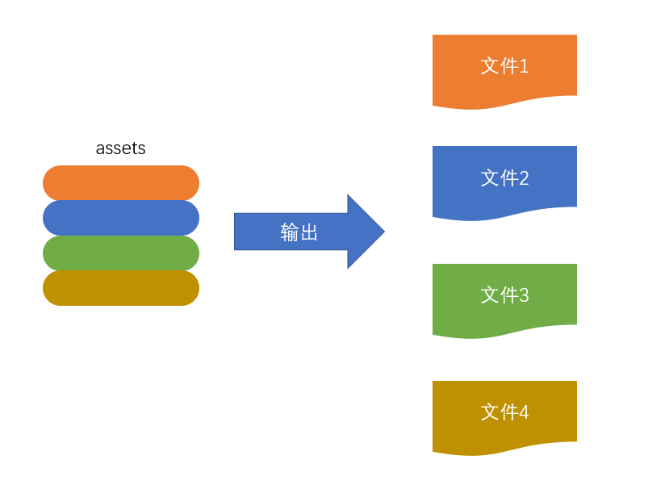

> 配置文件以`CommonJS`模块化方式导出一个配置对象，因为webpack是在node环境中执行的

webpack在打包的时候不会执行源代码，只会分析源代码，遇到`Commonjs`、`ES Module`等模块化代码会识别依赖，将源代码转换成可以在浏览器中运行的代码

```js
module.exports = {
  
}
```

webpack整个编译过程大致分三个步骤：

1. 初始化
2. 编译
3. 输出

## 初始化

在这个阶段，webpack会将**CLI参数、配置文件、默认配置**进行融合，形成一个最终的配置对象

这一步主要是为了下一步编译阶段做的必要准备，就是为编译阶段产生一个最终的配置

## 编译

### 创建chunk

> chunk：是webpack在内部构建过程的一个概念，翻译为块；表示通过某个入口找到的所有依赖的统称

`webpack`的默认入口模块是`./src/index.js`，根据入口模块创建一个默认名为`main`的chunk

可以有多个chunk，即入口模块可以有多个，就会构建对应的chunk并生成对应的bundle文件

每个chunk都至少有两个属性：

- name：默认为main
- id：唯一编号，开发环境和name一样，生产环境是一个数字，从0开始

### 构建所有依赖模块


从入口文件开始**读取文件内容，分析代码**（分析代码，不会执行源代码），将内容形成AST（抽象语法树）；通过分析找到该文件的**依赖（即引入了其他模块）**，将依赖（模块）路径保存到dependencies数组中；将有依赖的地方替换webpack的依赖函数（将require替换成webpack的`__webpack_require(moduleId)`函数），形成转换后的代码；将转换后的代码保存到一个数组中，数组每一项是一个对象，以模块id（模块路径）为key，以转换后的代码为value；模块1分析完毕，接着分析`dependencies`数组中的依赖，通过递归重复这个步骤，最终得到模块列表

### 产生chunk assets

第二步完成后，chunk中会产生一个模块列表，列表中包含了**模块id**和**模块转换后的代码**

webpack会根据配置为chunk生成一个资源列表，即`chunk assets`，资源列表可以理解为是生成最终文件的文件名和文件内容，称为`bundle`


:::tip
**chunk hash**：是根据所有chunk assets的内容生成的一个hash字符串

:::


### 合并chunk assets

将多个chunk的assets合并到一起，并产生一个总的hash


## 输出

webpack利用node的fs模块，根据编译产生的总的assets，生成相应的文件输出到output指定的目录



## 总过程


## 总结

1. module是模块，是分割的代码单元，是一个文件，webpack模块可以是任何内容的文件，不单是JS
2. chunk是webpack内部构建模块的块，一个chunk中包含多个模块，这些模块是从入口模块通过依赖分析得来
3. bundle是chunk构建好模块后生成chunk的资源清单，清单中的每一项就是一个bundle，bundle就是最终生成的文件
4. 根据入口可配置多个入口模块，就会生成多个chunk资源清单
5. hash是根据资源清单所有内容联合生成的hash值
6. chunkhash是每个chunk生成的资源清单内容联合生成的hash值
7. chunkname是chunk的名称，默认是main
8. id是每个chunk的唯一编号，开发构建id和chunkname相同，生成环境下构建会从数字0开始进行编号
