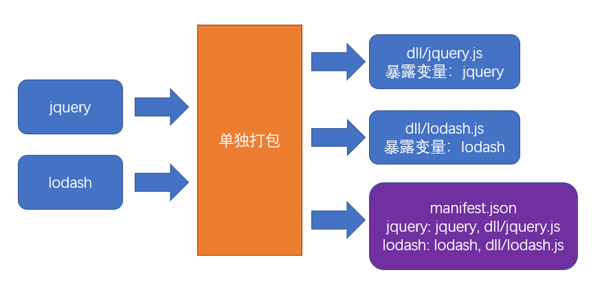

## 基本原理

### 先单独打包公共模块

例如jquery、lodash这些公共库在任何其他模块都有可能应用到，为了避免重复打包到其他模块的打包结果中，可以**单独**对公共模块打包



公共模块会被打包成为动态链接库（dll：dynamic link library），并生成资源清单

### 根据入口模块进行正常打包

打包时，如果发现模块中使用了资源清单中描述的模块，那么就不会将公共模块打包到chunks中

```js
//源码，入口文件index.js
import $ from "jquery"
import _ from "lodash"
_.isArray($(".red"));
```

chunks中不会包含公共模块的具体代码，而只导出一个全局变量

```js
(function(modules){
  //...
})({
  // index.js文件的打包结果并没有变化
  "./src/index.js":
  function(module, exports, __webpack_require__){
    var $ = __webpack_require__("./node_modules/jquery/index.js")
    var _ = __webpack_require__("./node_modules/lodash/index.js")
    _.isArray($(".red"));
  },
  // 由于资源清单中存在，jquery的代码并不会出现在这里
  "./node_modules/jquery/index.js":
  function(module, exports, __webpack_require__){
    module.exports = jquery;
  },
  // 由于资源清单中存在，lodash的代码并不会出现在这里
  "./node_modules/lodash/index.js":
  function(module, exports, __webpack_require__){
    module.exports = lodash;
  }
})
```

## 打包公共模块

打包公共模块是一个**独立的**打包过程

1. 单独打包公共模块，暴露变量名

暴露变量名需要配置`library`

```js
// webpack.dll.config.js
module.exports = {
  mode: "production",
  entry: {
    jquery: ["jquery"],
    lodash: ["lodash"]
  },
  output: {
    filename: "dll/[name].js",
    library: "[name]"
  }
};
```

2. 利用`DllPlugin`生成资源清单

```js
// webpack.dll.config.js
module.exports = {
  plugins: [
    new webpack.DllPlugin({
      path: path.resolve(__dirname, "dll", "[name].manifest.json"), //资源清单的保存位置
      name: "[name]"//资源清单中，暴露的变量名
    })
  ]
};
```

运行后，即可完成公共模块打包

## 使用公共模块

1. 在页面中手动引入公共模块

这个位置是相对于打包目录的位置，而非html文件所在目录位置

```html
<script src="./dll/jquery.js"></script>
<script src="./dll/lodash.js"></script>
```

2. 重新设置`clean-webpack-plugin`

如果使用了插件`clean-webpack-plugin`，为了避免它把公共模块清除，需要做出以下配置

```js
new CleanWebpackPlugin({
  // 要清除的文件或目录
  // 排除掉dll目录本身和它里面的文件
  cleanOnceBeforeBuildPatterns: ["**/*", '!dll', '!dll/*']
})
```

> 目录和文件的匹配规则使用的是[globbing patterns](https://github.com/sindresorhus/globby#globbing-patterns)

3. 使用`DllReferencePlugin`控制打包结果

需要告诉插件资源清单所在位置

```js
//webpack.prod.config.js
module.exports = {
  plugins:[
    new webpack.DllReferencePlugin({
      manifest: require("./dll/jquery.manifest.json")
    }),
    new webpack.DllReferencePlugin({
      manifest: require("./dll/lodash.manifest.json")
    })
  ]
}
```

## 总结

### 手动打包过程

1. 单独打包公共模块，配置`output.library`暴露公共模块
2. 用`webpack.DllPlugin`创建资源清单
3. 用`webpack.DllReferencePlugin`使用资源清单

### 注意事项

1. 资源清单不参与运行，可以不放到打包目录中
2. 在HTML文件中手动引入公共模块JS文件，使用`CleanWebpackPlugin`并配置不删除dll相关文件
3. 不要对小型的公共模块使用

### 优点

1. 极大提升自身模块的打包速度
2. 极大地缩小自身文件体积
3. 有利于浏览器缓存第三方的公共代码

### 缺点

1. 使用繁琐
2. 如果第三方库中也依赖了相同的第三方包，则会包含重复代码，效果不理想，还需要对相同部分进行配置