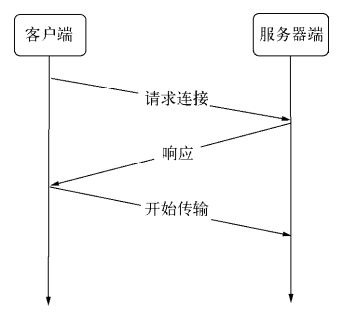
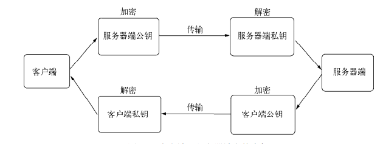

利用node可以十分方便地搭建网络服务器。在Web领域，大多数的编程语言需要专门的Web服务器作为容器

对于node而言，只需要几行代码即可以构建服务器，无需额外的容器

node提供 `net`、`dgram`、`http`、`https`模块，分别处理TCP、UDP、HTTP、HTTPS，适用于服务器端和客户端

## OSI模型

| OSI        | 协议或格式                                                   | 作用                                                         | 五层模型 |
| ---------- | ------------------------------------------------------------ | ------------------------------------------------------------ | -------- |
| 应用层     | HTTP FTP TFTP SMTP SNMP DNS TELNET HTTPS POP3 DHCP           | 网络服务于最终用户的一个接口                                 | 应用层   |
| 表示层     | jpeg ASCII 加密格式等                                        | 数据的标识、安全、压缩                                       | 应用层   |
| 会话层     |                                                              | 建立、管理、终止会话                                         | 应用层   |
| 传输层     | **TCP、UDP**，数据包一旦离开网卡即进入网络传输层**（MAC地址 + IP地址 + 端口号）** | 定义传输数据的协议**端口号**，以及留空和差错校验             |          |
| 网络层     | ICMP、IGMP、IP（IPV4 IPV6）**（MAC地址 + IP地址）**          | 进行逻辑地址寻址，实现不同网络之间的路径选择                 |          |
| 数据链路层 |                                                              | 建立逻辑连接，进行硬件地址寻址，差错校验等功能，由底层网络定义协议<br />将比特组合成字节进而组合成帧，用MAC地址访问介质 |          |
| 物理层     | **MAC地址**（网卡固有）                                      | 建立，维护，断开物理连接                                     |          |

## 构建TCP服务

传输控制协议（TCP），HTTP、SMTP、IMAP等协议都基于TCP构建

### 三次握手

`TCP`处于传输层，基于端口，面向连接的协议，显著特征是在传输之前需要3次握手形成会话

`TCP`的握手的挥手本质上都是四次，握手时可以将服务端向客户端发送ACK=1时同时发送SYN=1的请求，这可以合并，于是就有3次握手。

而断开连接必定需要4次挥手不能合并，因为一个服务端服务于多个客户端，客户端将请求发给服务端，服务端可能还没来得及将全部数据全部传回，所以在断开连接时需要分开处理




- SYN=1：请求建立连接

- FIN=1：请求断开连接

- ACK=1：数据信息确认

**第一次：客户端想服务器端发出连接请求**

同部位SYN=1，报文不能携带数据，SYN用于建立连接，FIN终止连接

初始序号seq=x

TCP客户进程进入SYN-SENT（同步已发送）状态

**第二次：服务器端接收到请求连接报文**

同意，向客户端发送确认报文，ACK=1，SYN=1，表示确认数据信息，并向客户端发送请求连接

ACK：成功，继续进行下一步

RST：出错，终止连接

确认号：ack=x+1

初始序号seq=y

TCP服务器进程进入SYN-RCVD（同步收到）状态

**第三次：客户端接收到服务端确认后，也要向服务端发报文确认**

**可以携带数据**，ACK=1，报文可写到数据，不携带数据不消耗序号

确认号ack=y+1

序号seq=x+1，初始为seq=x，第二个报文需要+1

**TCP连接已建立**

客户端进入ESTABLISHED(已建立连接)

服务器收到客户端确认后也进入ESTABLISHED状态

### 四次挥手

## 构建UDP

一旦创建，既可以作为客户端发送数据，也可作为服务端接收数据

一个套接字可与多个UDP服务通信

虽然提供面向食物的简单不可靠信息传输服务，在网络差的情况下存在丢包严重的问题，但它无需连接，资源消耗低，处理快速且灵活

常应用于音频、视频的传输

使用 ` dgram.bind(port,[address])`创建UDP服务器

## 构建HTTP服务

构建在TCP之上，属于应用层协议，Web就是HTTP应用之一

特点：

* 响应时，一问一答方式实现服务
* 处理HTTP请求和HTTP响应

### HTTP报文

1. 第一部分：TCP三次握手
2. 第二部分：客户端向服务端发送请求报文
3. 第三部分：服务器端完成处理，向客户端发送响应内容，包括**响应头**和**响应体**

### node的HTTP模块

继承自TCP，能与多个客户端保持连接

采用事件驱动，并不会为每个连接创建额外的线程或进程，保持很低的内存占用，实现高并发

与TCP的区别：

* 开启keepalive后，一个TCP会话可用于**多次**请求和响应
* TCP一connection为单位进行服务，HTTP以request为单位进行服务
* HTTP模块是将connection和request的过程进行了封装
* HTTP模块将连接所用套接字的读写抽象为**ServerRequest**和**ServerResponse**对象

### HTTP请求

#### 请求报文头

对TCP连接的读操作，HTTP模块将其封装为**ServerRequest**对象

`http_parse`对报文进行解析

* method
* url
* httpVersion
* 其余的放置在headers属性上

#### 请求报文体

**只读流对象**，只有读取完报文体中的数据才能进行操作

### HTTP响应

封装了对底层连接的写操作，将其封装成**ServerResponse**对象

**可写流对象**

#### 响应报文头

报文头是在报文体发送前发送的，一旦开始数据发送，writeHead()和setHeader()将不再生效

`response.setHeader(headerObj)`可以进行多次设置响应头

`response.writeHead(statusCode,headerObj)`调用了才会将报文头写入连接中

#### 响应报文体

`end()`会先调用write()发送数据，然后发送信号告知服务器这次响应结束

无论服务端在处理业务逻辑时是否发生异常，务必在**结束时调用 `end()`结束请求，否则客户端将一直处于等待状态**

`response.write()`和 `response.end()`实现发送数据

#### HTTP服务事件

HTTP服务器抽象一些事件，供应用层使用，服务器是一个 `EventEmitter`实例

* `connection`

  在开始HTTP请求和响应前，客户端与服务器端需要建立底层的TCP连接，这个连接可能因为开启了keep-alive，可以在多次请求响应之间使用；当这个连接建立时，服务器触发一次connection事件。
* `request`

  建立TCP连接后，http模块底层将在数据流中抽象出HTTP请求和HTTP响应，当请求数据发送到服务器端，在解析出HTTP请求头后，将会触发该事件；在res.end()后，TCP连接可能将用于下一次请求响应。
* `close`

  与TCP服务器的行为一致，调用server.close()方法停止接受新的连接，当已有的连接都断开时，触发该事件；可以给server.close()传递一个回调函数来快速注册该事件。
* `checkContinue`
* `connect`
* `upgrade`
* `clientError`

  连接的客户端触发error事件时，这个错误会传递到服务器端，此时触发该事件。

### HTTP客户端

`http.request(options,connect)`创建HTTP客户端

options

* `host`：服务器的域名或IP地址，默认localhost
* `hostname`：服务器名称
* `port`：服务器端口，默认80
* `localAddress`：建立连接的本地网卡
* `socketPath`：Domain套接字路径
* `method`：HTTP请求方法，默认GET
* `path`：请求路径，默认/
* `headers`
* `auth`：Basic认证，计算成请求头中的Authorization

#### 客户端事件

* `response`

  与服务器端的request事件对应的客户端在请求发出后得到服务器端响应时，会触发该事件。
* `socket`

  当底层连接池中建立的连接分配给当前请求对象时，触发该事件。
* `connect`

  当客户端向服务器端发起CONNECT请求时，如果服务器端响应了200状态码，客户端将会触发该事件。
* `upgrade`
* `continue`

  客户端向服务器端发起`Expect: 100-continue`头信息，以试图发送较大数据量，如果服务器端响应100 Continue状态，客户端将触发该事件

## 网络服务与安全

### TLS/SSL

TLS(安全传输层协议)/SSL(安全套接层)

#### 密钥



一个公钥/私钥的**非对称**结构

服务器端和客户端都有自己的公私钥

服务器端和客户端在建立安全传输前，需要**互换公钥**

使用**接收方的公钥加密**PEM数据传输

* 客户端发送数据需要通过服务器公钥加密
* 服务端发送数据需要客户端公钥解密

:::tip

公钥：加密要传输的数据

私钥：解密接收到的数据

:::

### OpenSSL生成RSA

```bash
#生成服务器和客户端的私钥
#生成1024位的rsa私钥文件
openssl genrsa -out server.key 1024
openssl genrsa -out client.key 1024

#利用私钥生成公钥
openssl rsa -in server.key -pubout server.pem
openssl rsa -in client.key -pubout client.pem
```

#### RSA仍存在窃听可能

中间人攻击：两端在交换公钥过程中，中间人扮演互相的角色，两端几乎感受不到中间人的存在，中间人可能会将伪造的站点响应给用户

解决方法：数字证书认证

### 数字证书

包含服务器的名称和主机名，服务器的公钥，签名颁发机构的名称，来自签名办法机构的签名

#### 数字证书认证中心

为站点颁发证书，且证书具有CA通过自己的公钥和私钥实现的签名

**自签名证书**

1. 扮演CA机构给自己的服务器端颁发签名证书，生成私钥RSA，CSR文件，生成签名证书CRT

    ```bash
    #生成ca的私钥
    openssl genrsa -out ca.key 1024
    #生成ca的csr文件
    openssl req -new -key ca.key -out ca.csr
    #生成crt自签名
    openssl x509 -req -in ca.csr -signkey ca.key -out crt
    ```

2. 服务器端向CA机构申请签名证书
   用**服务端私钥**RSA生成证书签名请求**CSR文件**

   ```bash
   openssl req -new -key server.key -out server.csr
   ```

   用CSR文件向CA申请签名证书，**需要CA的证书和私钥**

   ```bash
   openssl x509 -req -CA ca.art -CAkey ca.key -CAcreateserial -in server.csr -out server.crt
   ```


3. 客户端发起安全连接前获取服务器端证书，通过CA证书验证服务器端证书的真伪

## HTTPS服务

工作在TLS/SSL上

HTTPS服务需要用到私钥和签名证书

创建HTTPS服务，比HTTP服务多一个配置

```js
var https = require('https')
https.createServer({
	key: './key/server.key',
	cert: './key/server.crt'
},(req,res)=>{})
```

**curl工具无法验证自签名证书**

`-k`：忽略验证证书，存在中间人攻击风险

`-cacert`：告知CA证书完成对服务器证书的验证
